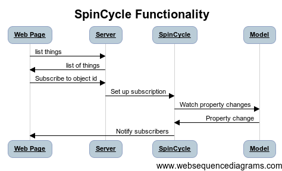

# SpinCycle

Opinionated message router and generalized ORM (with automatically persisted and loaded hierarchies) that let front-end clients subscribe to object property changes on the node.js server.
SpinCycle uses Node.js and Express and is written in CoffeeScript. 

## Overview
SpinCycle tries to remove as much boilerplate as possible between client and server communication. Just write models, define model relations, set up endpoints and you're ready to go.

A common use-case is that you have a web client which shows some of the properties on some of the models on the server. When these models are updated, the client need to know about this, one way or the other. SpinCycle takes away a lot of the pain and boilerplate in doing just that.

In more detail, this is what SpinCycle helps you with:

1. It lets the web client easily call exposed functions on the server using Ajax or WebSockets
  2. The server has a plugin-in AuthenticationManager that control user creation, lookup and rights (Easy to use with Passport).
  3. Object models used in SpinCycle must be a subclass of SpinCycle.SuperModel
  4. The models are always flat, using ids or arrays of ids to refer to other models
  5. The models are created and persisted using records that are separated from the DB used (currently working adapters are CouchDB and MongoDB, with MongoDB being used as default)
  6. A web client can subscribe to changes to object properties (if using the WebSockets transport method) as well as update objects, both using any custom AuthenticationManager for control.

So you really only need to create your model classes and expose functions giving access to them and all client updates will occur automatically.

If you want to skip all the details, just clone the repo, change to the examples folder, don't forget to do **npm install** and also **bower install** and then run the sample server using **node server.js**. Perhaps also have a look around at the code.

# Client-side

The client example is written in Polymer, but more client libs are planned. To use the client, make sure it is imported in your main component, or maybe in the index.html file. We're depending on an instance of socket.io being created and passed on to the example client at the moment (and yes, I know you can do what's immedaitely below using just Socket.IO :)

    <link rel="import" href="../../elements/message-router/message-router.html">

To call an exposed target function on the server

    this.asyncFire('core-signal', {name: "emit", data: {target:'listGames', callback: this.onListGames.bind(this) }});
    
    onListGames: function(games)
    {
        console.log("onGamesList called with ");
        console.dir(games);
        this.games = games;
    }

# A sample server configuration:

    express         = require("express")
    app             = express()
    server          = require("http").createServer(app)
    AuthenticationManager = require('./backend/AuthenticationManager')  # We're coming to this in a bit
    app.use express.static("app")
    #--------------------------------------------------> Set up Message Router
    authMgr       = new AuthenticationManager(app)
    messageRouter = new SpinCycle(authMgr)
    #--------------------------------------------------> Express Routing
    new SpinCycle.HttpMethod(messageRouter, app, '/api/')
    #<-------------------------------------------------- Express Routing
    #--------------------------------------------------> WS Routing
    new SpinCycle.WsMethod(messageRouter, server)
    #<-------------------------------------------------- WS Routing
    
# Making use of SpinCycle:

    Logic         = require('./backend/Logic')
    # Adding sample logic
    logic = new Logic(messageRouter)
    
    
# Inside the custom logic:

    constructor: (@messageRouter) ->
      @games = []
      @messageRouter.addTarget('listGames',   '<noargs>', @onListPlayerGames)
      
    onListPlayerGames: (msg) =>
      rv = []
      console.log 'onListPlayerGames for player '+msg.user.id
      @games.forEach (game) ->
        console.log '   onListPlayerGames listing game "'+game.name+'"'
        rv.push game.toClient()
      msg.replyFunc({status: e.general.SUCCESS, info: '', payload: rv})      
      
So the method **addTarget** on SpinCycle exposes any function to be called by the installed transport methods, and on the client, calling the function uses Polymers **core-signal** to pass through the call to Socket.io.

This is not really terribly useful now, is it. So let's look at something which might be instead; Object property subscriptions.

# Creating a simple object model:

    SuperModel      = require('SpinCycle').SuperModel
    defer           = require('node-promise').defer
    uuid            = require('node-uuid')

    class SampleGame extends SuperModel

      @type       = 'SampleGame'
      @model =
        [
          {name: 'players', public: true,   array: true,   type: 'SamplePlayer', ids: 'players' }
          {name: 'name',    public: true,   value: 'name', default: 'game_'+uuid.v4() }
        ]
    
      constructor: (@record) ->
        return super
      
      # postCreate gets called (if declared) after the full object graph has been reconstructed
      postCreate: (q) =>
        if @players.length == 0
          @createPlayers().then () =>
            q.resolve(@)
        else
          q.resolve(@)

    module.exports = SampleGame
    
The model property of the class tells spincycle which properties to save when serializing this object, but also which properties to instantiate this object with when given a record, and finally which properties it's OK to copy over to the client when synchronizing object properties (or just handing out the object to a target service)

Properties can be basic, like strings or numbers, where the property name is defined in the 'value' property. So that if you want the object property 'shoeSize' to be instantiated from record and saved when serializing you write just that in the 'value' property.

Properties can also be direct object references, arrays or hashtables. In all cases the 'ids' property will be an array where references are stored when serializing the object or read from when creating the object anew from storage.

When spincycle resolves the object class (using file acrobatics and require under the hood) it then chucks an actual reference, array of references or hastable of references (in the latter case the target object's 'name' property is always used as key. Deal with it).

If a property is declared 'public:true', it will be included in object copies sent to client.

The magic is done in the SuperModel super class of each model and it's absolutely necessary to do 'return super' (or possibly just 'super') at the end of the model constructor for all this to work

# The Authentication Manager

This class is used whenever a message is sent to the SpinCycle server from a client. It is responsible for decorating the passing message with a user object, or create an anonymous one, so that logic further down the line can identify which user is trying to do what, without having to look stuff up in the middle of doing other things.

It also have two specific methods that are called when a message is sent that tries to either update an object or subscribe to property changes of an object; **canUserWriteToThisObject** and **canUserReadFromThisObject** respectively.

A very simple implementation could look like this;

    defer           = require('node-promise').defer
    uuid            = require('node-uuid')

    class AuthenticationManager

      constructor: ()->
        @anonymousUsers = []
        console.log '** new AuthMgr created **'

      # The messagerouter will make sure the message contains a 'client' property which will be unique for each         client (made up of its ip-address + port)
      # This can be used to recognize and map recurring users between messages
      decorateMessageWithUser: (message) =>
        q = defer()
        # Either we look up the user by client key or we create a super-simple user (containing only an 'id'              property) and storing that in our hashtable
        user = @anonymousUsers[message.client] or
          id: uuid.v4()
        message.user = user
        q.resolve(message)
        @anonymousUsers[message.client] = user
        return q

       # When a user sends a 'registerForUpdatesOn' message to SpinCycle, this method will be called once to allow or disallow the user to be apply to subscribe to project changes of an object
        canUserReadFromThisObject: (obj, user) =>
          true # not much checking, eh?
      
        # When a user sends a 'updateObject' message, this method gets called to allow or disallow updating of the object
        canUserWriteToThisObject: (obj, user) =>
          true # same here
      
        # When a user sends a '_create'+<object_type> message, this method gets called to allow or disallow creating of the object
        canUserCreateThisObject: (obj, user) =>
          true # same here
      
        # When a user sends a '_create'+<object_type> message, this method gets called to allow or disallow creating of the object
        canUserListTheseObjects: (type, user) =>
          true # same here

    module.exports = AuthenticationManager
    
    
The AuthnaticationManager is also a nice place to put any passport custom login logic dealing with users, since it's here they will be needed, saved, found, decorated on messages and so on.

## Object property subscriptions

Let's say you have got a list of objects on the client and fancy subscribing to one of them. This is how you go about it;

    this.asyncFire('core-signal', {name: "objectsubscribe", data: {obj:{id: this.selectedgame.id, type: 'game'}, callback: this.onGameUpdate.bind(this) } });
    
    onGameUpdate: function(game)
    {
        console.log("onGameUpdate called. game is "+game);
        console.dir(game);
        this.selectedgame = game;
        this.update = JSON.stringify(game);
    }
    
On the serverside, whenever **serialize()** is called on an object, the ObjectManager will check if there are any subscriptions going and notify clients with the updated object.

And that's all there is to it, more or less. Please let me know when you find bugs or have ideas for improvement, especially when it comes to developer experience and ease of use / time to launch.
